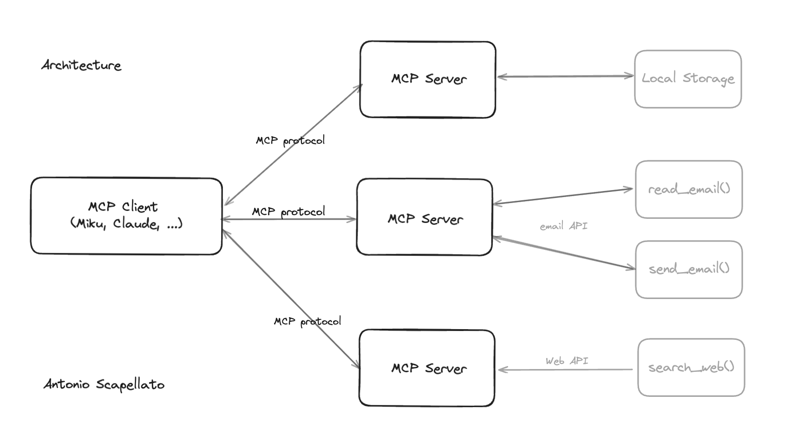

# MCP Server Sample

This repository contains an implementation of a Model Context Protocol (MCP) server for educational purposes. This code demonstrates how to build a functional MCP server that can integrate with various LLM clients.



# MCP Server Example

This repository contains an implementation of a Model Context Protocol (MCP) server for educational purposes. This code demonstrates how to build a functional MCP server that can integrate with various LLM clients.

References: 
- [Model Context Protocol - Anthropic](https://modelcontextprotocol.io/).
- [MCP - Python](https://pypi.org/project/mcp/).

## What is MCP?

MCP (Model Context Protocol) is an open protocol that standardizes how applications provide context to LLMs. Think of MCP like a USB-C port for AI applications - it provides a standardized way to connect AI models to different data sources and tools.


### Key Benefits

- A growing list of pre-built integrations that your LLM can directly plug into
- Flexibility to switch between LLM providers and vendors
- Best practices for securing your data within your infrastructure

## Architecture Overview

MCP follows a client-server architecture where a host application can connect to multiple servers:

- **MCP Hosts**: Programs like Claude Desktop, IDEs, or AI tools that want to access data through MCP
- **MCP Clients**: Protocol clients that maintain 1:1 connections with servers
- **MCP Servers**: Lightweight programs that expose specific capabilities through the standardized Model Context Protocol
- **Data Sources**: Both local (files, databases) and remote services (APIs) that MCP servers can access

## Core MCP Concepts

MCP servers can provide three main types of capabilities:

- **Resources**: File-like data that can be read by clients (like API responses or file contents)
- **Tools**: Functions that can be called by the LLM (with user approval)
- **Prompts**: Pre-written templates that help users accomplish specific tasks

## System Requirements

- Python 3.10 or higher
- MCP SDK 1.2.0 or higher
- `uv` package manager

--- 

### Installation
Adding MCP to your python project
We recommend using uv to manage your Python projects.

If you haven't created a uv-managed project yet, create one:

```
uv init mcp-server-sample
cd mcp-server-sample
```

Then add MCP to your project dependencies:

```console
uv add "mcp[cli]
```
Alternatively, for projects using pip for dependencies:

```console
pip install "mcp[cli]"
```

Running the standalone MCP development tools
To run the mcp command with uv:

```console
uv run mcp
```

### Quickstart
Let's create a simple MCP server that exposes a calculator tool and some data:

```python
# server.py
from mcp.server.fastmcp import FastMCP

# Create an MCP server
mcp = FastMCP("Demo")


# Add an addition tool
@mcp.tool()
def add(a: int, b: int) -> int:
    """Add two numbers"""
    return a + b


# Add a dynamic greeting resource
@mcp.resource("greeting://{name}")
def get_greeting(name: str) -> str:
    """Get a personalized greeting"""
    return f"Hello, {name}!"
```

You can install this server in Claude Desktop and interact with it right away by running:

```console
mcp install server.py
```
Alternatively, you can test it with the MCP Inspector:

```console
mcp dev server.py
```

Made with ❤️ by [Antonio Scapellato](https://scapellato.dev)


## License

This project is licensed under the MIT License. See the [LICENSE](LICENSE) file for details.